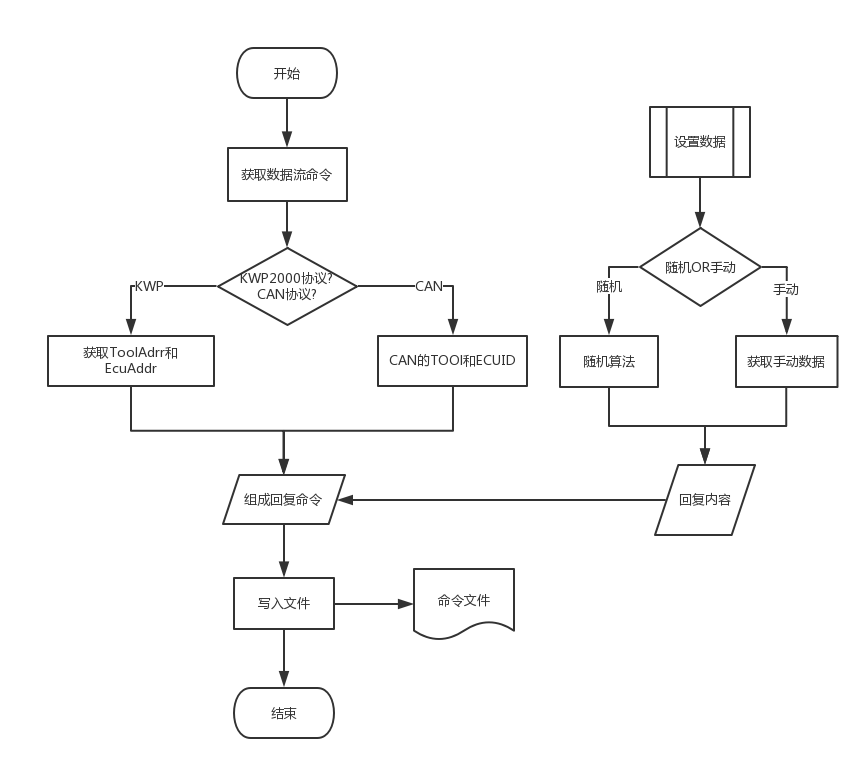

2017/09/26  
yqq

# 数据流造数工具

## 0.使用说明

- 使用之前先将"../src3/createData.py"中的"获取历史数据"注释掉(仅保留头部).
- 运行"../src3/createData.py"
- 运行"MakeCmdDataForDsTest.py" 
(每运行一次都会随机生成不同的数据,生成的文件在"../doc/out_DsTest/"目录下, 
DsTest?的目录名会自动随着运行次数增加)

## 1.问题描述
- 每次测试数据流都要等设备发出命令之后,再复制模拟其中的命令到命令文件中回复,
如果有50条命令那么就要让设备发50次,然后重复复制粘贴的命令50次.这显然效率太低,费时费力.

- 如果需要更改测试数据,就得挨个文件就替换.

## 2.程序功能

- [x] KWP协议
- [x] CAN协议
- [x] 自定义长度
- [x] 自定义数据
- [ ] 图形界面
- [x] 自动生成随机数据
- [x] 随机数据

## 3.设计

- 获取数据流命令
- 通过拼接计算(校验和), 组合成数据流命令
- 获取自定义的"回复数据", 将此"回复数据"放在数据流命令下
- 写入文件

## 4.流程图

